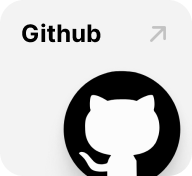

# 제주도 바닷가를 따라, 바당따라
🏆 **한국관광공사 X 카카오 2024 관광데이터 활용 공모전 장려상 수상작** 🏆

 

    
    
    

 

## Member
|[강예린](https://github.com/rkddpfls02)|[고도희](https://github.com/doteeth83)|[김예일](https://github.com/yeilkk)|[문인배](https://github.com/MoonInbae)|[이지우](https://github.com/Jiwoo-Leee)|
|:---:|:---:|:---:|:---:|:---:|
||||||
| **Backend Developer** | **Frontend Devleoper** | **Frontend Devleoper   Backend Developer   Team Leader** | **Infra Engineer   Backend Developer** | **Backend Developer** | **Backend Developer** |
